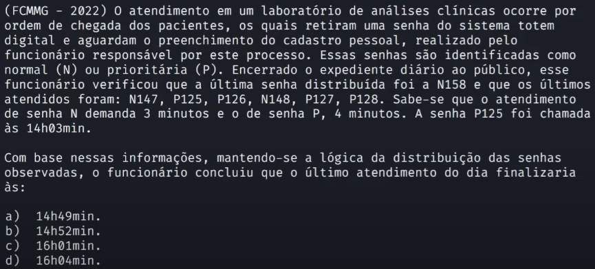
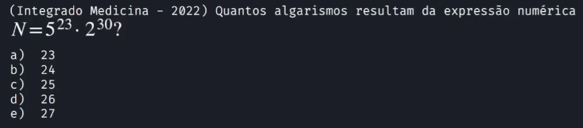
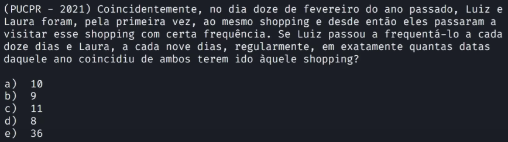

# Fundamentos matemáticos | Matemática básica | Aula 01

> ## **Exercício 1**

### **Enunciado**

### **Resolução**

1. Considerando o início do atendimento da senha P125

2. Analisando a sequência apresentada, o número de senhas prioritárias que antecedem uma senha normal será sempre 2

3. Depois da senha P125, teremos 11 senhas normais e 22 senhas prioritárias, considerando como última senha N158

4. Calculando o tempo total, teremos:

   $$
   22 \times 4 + 11 \times 3 = 121 minutos = 2h1min
   $$

> A **conversão de unidades** é fundamento que é abordado por uma área da matemática chamada **análise dimensional**

5. Portanto o último atendimento do dia finaliza às:

   $$
   14h03min + 2h01min = 16h04min
   $$

Resposta: alternativa D

> ## **Exercício 2**

### **Enunciado**

### **Resolução**

1. Deixar os expoente iguais nas bases diferentes

   $$
   N = 5^{23} \times 2^{30} \Leftrightarrow N = 5^{23} \times 2^{23} \times 2^{7}
   $$

2. Colocar em evidência o expoente 23

   $$
   N = (5 \times 2)^{23} \times 2^{7} \Leftrightarrow N = 10^{23} \times 128
   $$

3. Deixar o número em notação científica

   $$
   N = 1,28 \times 10^{25}
   $$

4. Portanto, N terá 26 algarismos

Resposta: alternativa D

> ## **Exercício 3**

### **Enunciado**

### **Resolução**

1. Os dias do ano em que as visitas de Luiz e Laura coincidem é dado pelos múltiplos em comum de 12 e 9

2. Não pode extrapolar o número de dias no ano e deverá ser maior que 43 (31 dias de janeiro + 12 dias de fevereiro)

3. Estamos buscando múltiplos em comum de 12 e 9

   $$
   mmc(12, 9) = mmc(2^{2} \times 3, 3^{2}) = 2^{2} \times 3^{2} = 36
   $$

4. E então, os múltiplos de 36, maiores que 43 e menores que 365 são:

   $$
   dias = {72, 108, 144, 180, 216, 252, 288, 324, 360}
   $$

5. Portanto, as visitas coincidiram em 9 datas distintas

Resposta: alternativa B