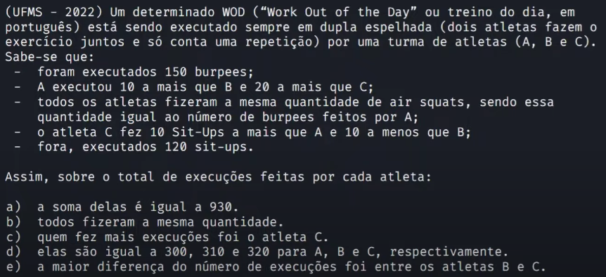

# Fundamentos matemáticos | Equações | Aula 02

> ## **Exercício 1**

### **Enunciado**

### **Resolução**

Quantidade de burpees / atleta

$$
b_A + b_B + b_c = 150 \Leftrightarrow b_A + b_A - 10 + b_A = 150 \Rightarrow b_A = 60
\therefore b_B = 50 \; e \; b_C = 40
$$

Quantidade de air squats / atleta

$$
a_A = a_b = a_C = 60
$$

Quantidade de Sit-Ups / atleta

$$
s_A + s_B + s_C = 120 \Leftrightarrow s_C - 10 + s_C + 10 + s_C = 120 \Rightarrow s_C = 40
\therefore s_A = 30 \; e \; s_B = 50
$$

Total de exercício / atleta

$$
t_A = 60 + 60 + 30 = 150 \\
t_B = 50 + 60 + 50 = 160 \\
t_C = 40 + 60 +40 = 140
$$

Portanto

$$
t_B - t_C = 20
$$

Resposta: alternativa E