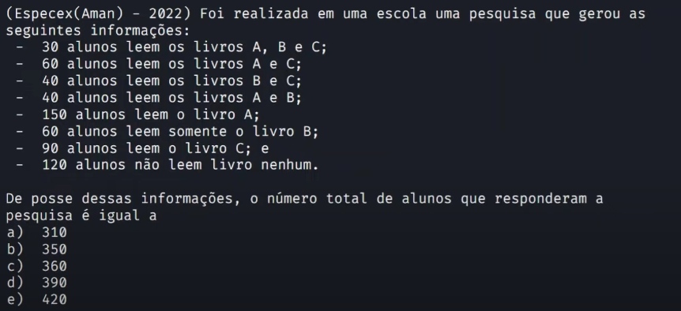

# Fundamentos matemáticos | Conjuntos | Aula 03

> ## Exercício 3

### **Enunciado**

### **Resolução**

Princípio da inclusão e exclusão

$$
total = |A| + |B| + |C| - |A \cap B| - |A \cap C| - |B \cap C| + |A \cup B \cup C| \\
total = 150 + 110 + 90 - 40 - 30 - 10 + 30 \\
total = 240
$$

Do total somar o resto de 120

$$
total + 120 = 360
$$