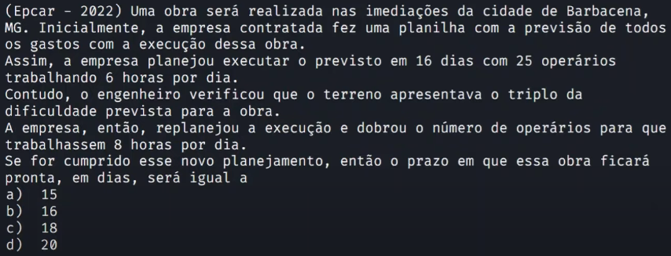

# Fundamentos matemáticos | Razões e proporções | Aula 04

> ## **Exercício 3**

### **Enunciado**

### **Resolução**

| Dias | Horas por dia | Funcionário | Dificuldade |
| :--: | :-----------: | :---------: | :---------: |
|  16  |       6       |     25      |      d      |
|  x   |       8       |     50      |     3d      |

Dias, horas por dia e funcionários são diretamente proporcionais, já dificuldade é inversamente proporcional.

$$
\frac{8 \times 50 \times x}{3 \times d} = \frac{16 \times 6 \times 25}{d} \\
400 \times x = 7200 \\
x = 18
$$

Resposta: alternativa C